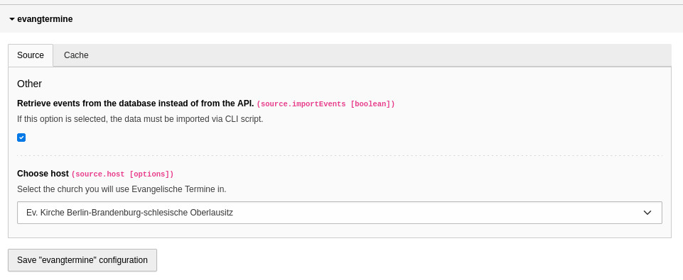
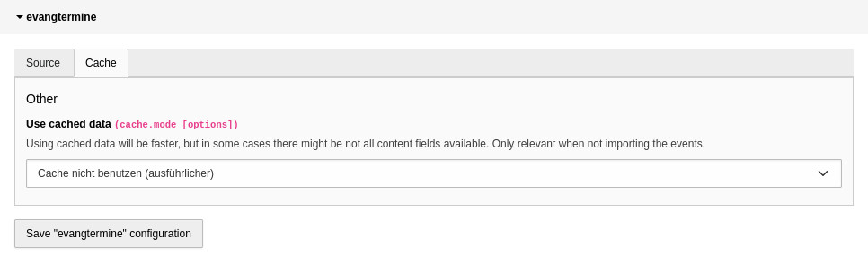
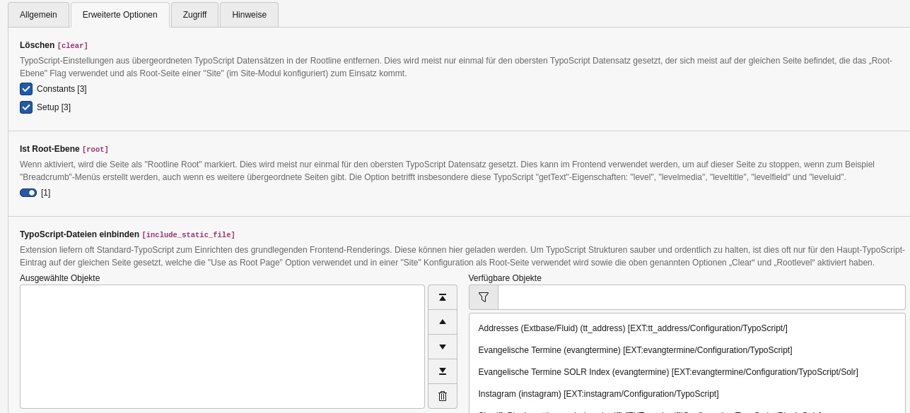

Installation
------------

Die Installation erfolgt entweder über composer: ``composer req sudhaus7/evangtermine`` oder
über den Erweiterungsmanager. Extension-Key: **evangtermine**

Auswahl Import, Landeskirche und Cachemodus
^^^^^^^^^^^^^^^^^^^^^^^^^^^^^^^^^^^

Im Zug der Installation muss die Auswahl getroffen werden:

* Ob die Termine importiert und in der Datenbank gespeichert werden sollen
* In welcher Landeskirche die Extension eingesetzt wird
und wenn Sie die Termine nicht in der Datenbank speichern

* Ob XML-Daten aus dem Cache von evangelische-termine.de geholt werden sollen

Wählen Sie dazu im Erweiterungsmanager unter "Einstellungen -> Extension Configuration" in der Liste die Extension evangtermine.
Klicken Sie dann auf den Namen der Extension.

	Auswahl API/Import und Landeskirche

	Auswahl des Cache-Modus

Speichern Sie die Auswahl.

.. hint::
    Die Option **Cache-Modus** ist nur relevant, wenn die Daten nicht per CLI-Skript in der Datenbank gespeichert werden.

.. tip::
	Cache oder Direktabruf? Der Cache-Abruf ist schneller und schont Ressourcen des Webservers von evangelische-termine.de,
	der direkte Abruf belastet den Server mehr, ist inhaltlich aber ausführlicher bei der Anzeige einer einzelnen Veranstaltung.
	Wenn möglich, sollte der Cache-Abruf verwendet werden.
	Hier hilft auch ausprobieren. Bei selbst erstellten Veranstaltungstypen kann es nötig sein, den Direktabruf zu verwenden.

Import der Termine
^^^^^^^^^^^^^^^^^^

Wenn Sie die Dateien importieren möchten, können Sie das per Konsolenbefehl tun:

..  code-block:: bash

     vendor/bin/typo3 evangtermine:importevents

und als Cronjob, beispielsweise täglich um 1 Uhr morgens:

..  code-block:: bash

      0 1 * * * /usr/bin/php8.3 /ABSOLUTER/PFAD/ZUM/PROJEKT/vendor/bin/typo3 evangtermine:importevents

Aktivierung im TypoScript-Template
^^^^^^^^^^^^^^^^^^^^^^^^^^^^^^^^^^

Rufen Sie das TypoScript-Template der Wurzelebene Ihrer Website auf. Wählen Sie "Vollständigen Template-Datensatz bearbeiten".
Innerhalb des Reiters "Erweiterte Optionen" wählen Sie das statische TypoScript der evangtermine-Extension (**Evangelische Termine (evangtermine)**)
aus und speichern die Auswahl.
Falls Sie die Veranstaltungen in der Datenbank speichern, können Sie **Evangelische Termine SOLR Index (evangtermine)** auswählen,
um die Veranstaltungen in Ihrem Solr zu speichern.

.. hint::
    Die Stichwortsuche im Plugin verwendet in jedem Fall die API, um die Veranstaltungen zu filtern, nicht Ihren Solr.
    Die Speicherung in Ihrem Solr ermöglicht allerdings die Ausgabe von Veranstaltungen als Treffer der globalen Suche auf der Website.

	Aktivierung der Extension im TypoScript-Template

